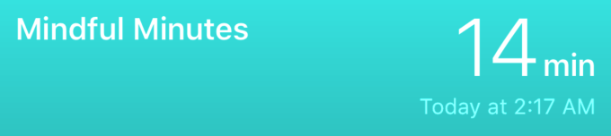
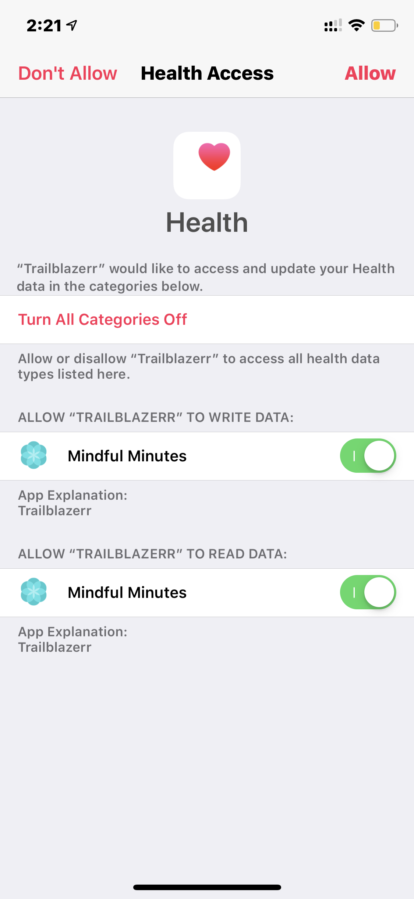
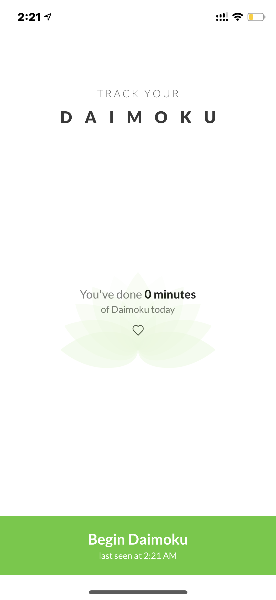
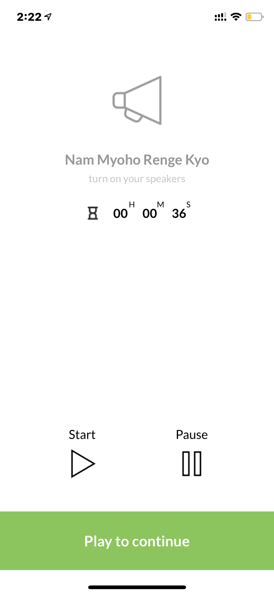
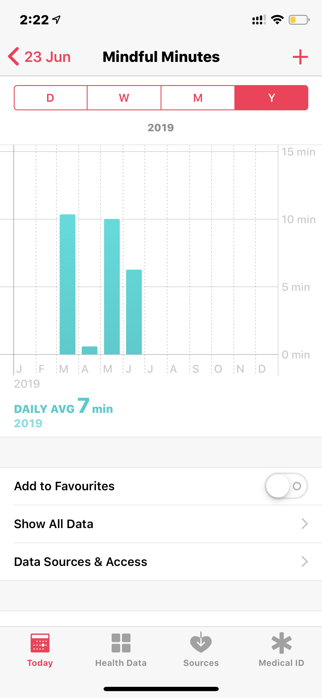

# Trailblazerr - Meditation Application
### Introduction about the application

Trailblazerr allows you to keep a track of your Daimoku. It shows you the duration of Daimoku you practised today. It provides a clean interface to allow all the followers to chant "Nam Myoho Renge Kyo" offline. Nam-myoho-renge-kyo could be described as a vow, an expression of determination, to embrace and manifest our Buddha nature. 

It is a pledge to oneself to never yield to difficulties and to win over one’s suffering. At the same time, it is a vow to help others reveal this law in their own lives and achieve happiness. Namu Myōhō Renge Kyō (南無妙法蓮華經) (also pronounced Nam Myōhō Renge Kyō) (English: Devotion to the Mystic Law of the Lotus Sutra or Glory to the Sutra of the Lotus of the Supreme Law) is the central mantra chanted within all forms of Nichiren Buddhism.

The words Myōhō Renge Kyō refer to the Japanese title of the Lotus Sūtra. The mantra is referred to as daimoku (題目)[4] or, in honorific form, o-daimoku (お題目) meaning title and was first revealed by the Japanese Buddhist priest Nichiren on the 28th day of the fourth lunar month of 1253 at Seichō-ji (also called Kiyosumi-dera) in present-day city of Kamogawa, Chiba prefecture, Japan.

The practice of prolonged chanting is referred to as shōdai (唱題) while the purpose of chanting daimoku is to reduce sufferings by eradicating negative karma along with reducing karmic punishments both from previous and present lifetimes,[7] with the goal to attain perfect and complete awakening.

The application takes the advantage of HealthKit framework by Apple to track your history of practise over a period of time becoming better in the meditation practise. 

## Application Preview

### Frameworks
- HealthKit
- Swift 5
- UIKit

### Notes
<i>We do not own the music recording used. We do not intend to use this for commercial purposes. This app is to assist people who want to follow Nicherin Buddhism. This app is meant for educational purposes only.</i>
